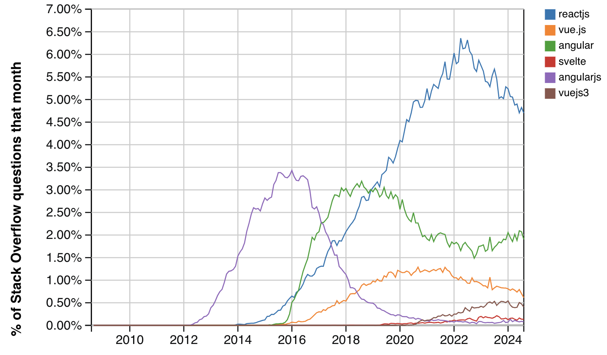
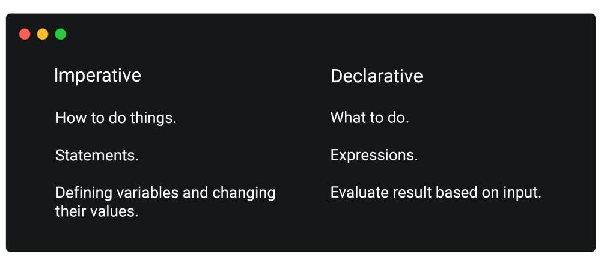
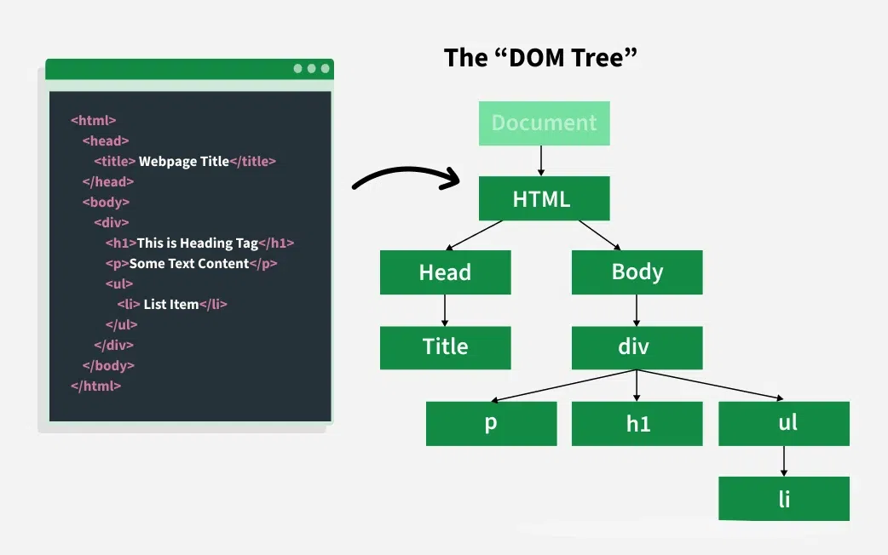
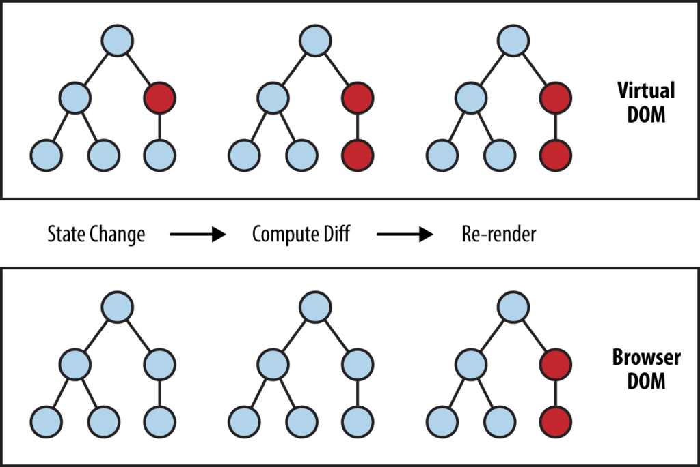

# React.js and Next.js Mastering Course - Session 05

## 7. What is React and why use it? ✅

### What is **React.js**?

React is a popular JavaScript library for building user interfaces, especially single-page applications. It allows you to create reusable UI components and efficiently update the UI when data changes.



### Why Use React?

- **Component-Based**: Build encapsulated components that manage their own state.
- **Declarative**: Describe what you want to see, and React updates the UI efficiently.
- **Virtual DOM**: React uses a virtual DOM to optimize rendering and improve performance.
- **Strong Community**: Large ecosystem and community support.

**::: Declarative vs Imperative :::**


<br />

<br />

**::: DOM - Document Object Model :::**


<br />

<br />

**::: Virtual DOM :::**



### Example

```javascript
import React from "react";

function Welcome(props) {
  return <h1>Hello, {props.name}!</h1>;
}

// Usage in a React app
// <Welcome name="Alice" />
```

React makes it easy to build interactive and dynamic web applications by breaking the UI into small, manageable pieces.

1. **Setting up the dev environment with `Create Next App`** ✅
   - Introduction to **Create Next App**
   - Installing **Node.js** and **npm**
   - Creating a new Next.js project

2. **Next.js Project Structure** ✅
   - Overview of the project files and folders
   - Understanding the purpose of each file
     - **`package.json`**
     - **`package-lock.json (npm)`**
     - **`pnpm-lock.yaml (pnpm)`**
     - **`pnpm-workspace.yaml (pnpm)`**
     - **`next.config.json`**
     - **`README.md`**
     - **`pnpm-workspace.yaml (pnpm)`**
     - **`tsconfig.json`**
     - **`.gitignore`**
     - **`eslint.config.mjs`**
     - **`/node_modules`**
     - **`/.next`**
     - **`AGENTS.md and CLAUDE.md`**
     - **`/app`**
       - **`layout.tsx`**
       - **`favicon.ico`**
       - **`eslint.config.mjs`**
       - **`globals.css`**
     - **`/public`**
     - **`/.vscode`**

3. **JavaScript Linting with ESLint** ✅

- Linting in JavaScript is the automated process of analyzing your source code to catch programmatic bugs, syntax errors, and stylistic inconsistencies without actually executing the code. Because JavaScript is a dynamically typed and interpreted language, it doesn't have a strict compilation phase to catch mistakes before runtime. A linting tool (or "linter") acts as a guard, scanning your code as you write it to ensure it remains clean, maintainable, and bug-free

- Alternatively, Biome

4. **Node.js Runtime and Node Package Manager (npm/pnpm)** ✅
   - Role of **`Node.js`** in your project.

     Node.js acts as the runtime environment that allows your Next.js application to execute JavaScript code on the server. It handles server-side rendering, runs the development server, and manages build processes. Without Node.js, you would not be able to run, develop, or build your Next.js project, as it provides the necessary APIs and infrastructure for these tasks.

   - **The Birth of Node.js**

     **Node.js was created by Ryan Dahl in 2009**. He introduced it to the world in **November 2009** and showed that JavaScript could run outside the browser.

   - **The Problem It Solved**

     Before Node.js, many web servers used a thread-per-request model, which could become inefficient when handling lots of users at the same time. Ryan Dahl wanted a better way to handle many connections without blocking the whole process. This was especially important for real-time features like file uploads and live data updates.

   - **How It Was Built**

     Dahl used **Google's V8 JavaScript engine** to run JavaScript efficiently, then added an **event loop** and a low-level **I/O API**. This allowed JavaScript to interact with the operating system, files, and network ports—making server-side JavaScript possible.

   - **Key Early Milestones**
     - **2009**: Node.js was created and first introduced publicly.
     - **2010**: **npm** was launched by Isaac Schlueter, creating a huge package ecosystem for sharing reusable code.
     - **2011**: Windows support improved, and companies like **LinkedIn** and **Uber** started using Node.js in production.
     - **2012 onward**: Node.js became widely adopted for APIs, real-time apps, tooling, and modern web development.

     Node.js was built around a non-blocking, event-driven model, which made it efficient for real-time applications and scalable server-side work. That is one of the main reasons it became so important in modern web development and in tools like Next.js.

   - How Node.js enables the execution of JavaScript code outside the browser.

     Node.js is a JavaScript runtime built on Chrome's V8 engine that allows JavaScript to run on the server, outside of a web browser. It provides APIs for file system access, networking, and other server-side functionalities, making it possible to build scalable backend applications using JavaScript.

   - Why Node.js is required for running Next.js applications, including server-side rendering and development tooling.

     Next.js relies on Node.js to execute server-side code, such as rendering React components on the server before sending HTML to the client (server-side rendering). Node.js also powers the development server, hot reloading, and build processes that are essential for developing and deploying Next.js applications.

   - How Node.js interacts with npm to manage dependencies and scripts.

     Node.js uses npm (Node Package Manager) to install, update, and manage project dependencies. npm also allows you to define and run scripts (like `npm run dev` or `npm run build`) that automate common development tasks in a Next.js project.

5. **Dependencies vs DevDependencies** ✅
   - Explanation of dependencies and devDependencies
   - **React.js `v19` and its Community**
     - Developed by **`Facebook (Meta)`**, React was created by **`Jordan Walke`**, a software engineer who initially built a component library called _F-Bolt_ (later renamed to _FaxJS_) for PHP.
     - React was first deployed in the **Facebook News Feed** in 2011 and later integrated into **Instagram** in 2012.
     - The React ecosystem has grown rapidly, with a huge community and many notable contributors, such as **`Dan Abramov`** (creator of `Redux` and `React Hot Loader` **React Transform**).
   - **Next.js `v15.2` and its Evolution**
     - Next.js is a popular React framework that simplifies server-side rendering, static site generation, and routing.
     - It has evolved significantly, with version 15.2 introducing new features and improvements to enhance developer experience and performance.
   - How to manage theme in a Next.js project

6. **NPM Commands** ✅
   - Common npm commands (e.g., `npm install`, `npm run dev`, `npm run build`)
   - Practical examples and usage

7. **Running the project on Local Dev Server** ✅
   - Starting the development server
   - Accessing the project in the browser
   - Troubleshooting common issues

8. [React Documentation](https://react.dev/learn)
9. [Next.js Documentation](https://nextjs.org/docs)
