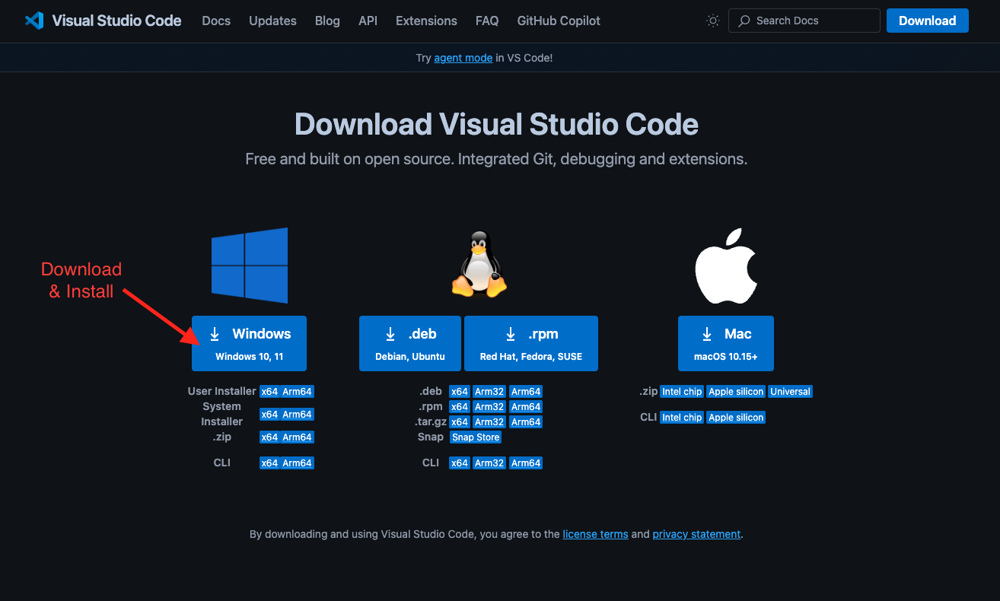
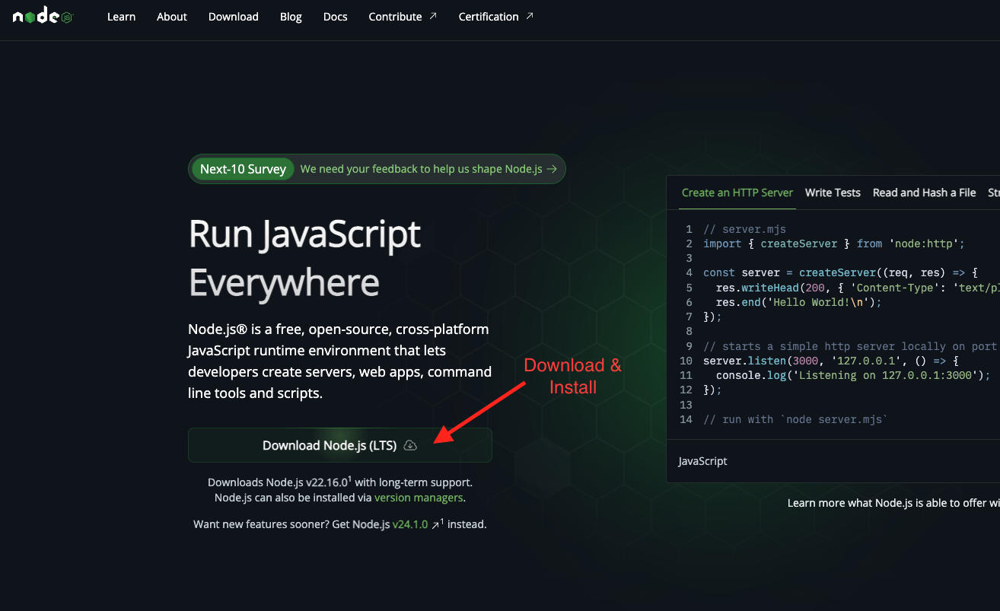
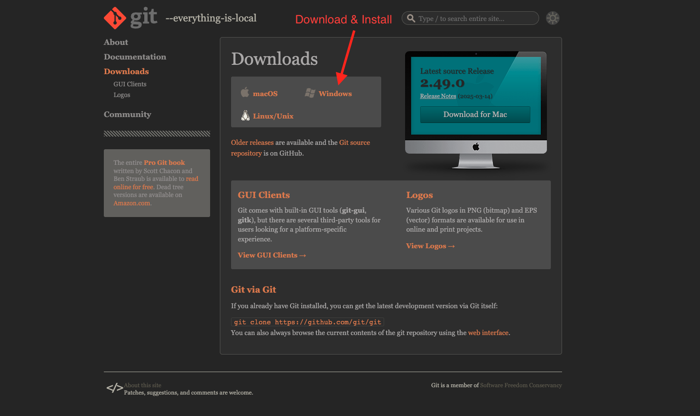

# 🛠️ Initial Setup Guide – React & Next.js Master Course

Welcome to the **React & Next.js Master Course**! Before we dive into building powerful web applications, make sure your development environment is properly set up.

---

## 1. ✅ Install **Visual Studio Code (VS Code)**

VS Code is a powerful, lightweight code editor with great support for JavaScript and React development.



- 📥 Download from: [https://code.visualstudio.com/](https://code.visualstudio.com/Download)
- 📦 Recommended Extensions:
  - **ESLint** – Lint your JavaScript code
  - **Prettier** – Code formatter
  - **Tailwind CSS IntelliSense** – Autocomplete for Tailwind CSS
  - **Live Server** - Local server for static and dynamic html
  - **React Developer Tools** (Browser extension)

---

## 2. ✅ Install **Node.js (v22.x)**

We’ll be using Node.js version **22.x**, which includes everything needed to run and build our React and Next.js apps.

- 📥 Download from: [https://nodejs.org/en](https://nodejs.org/en)
- ⚙️ **Note:** Installing Node.js will also automatically install the matching version of **npm** (Node Package Manager).



After installation, verify the versions by running the following in your terminal:

```bash
node -v
# Expected output: v22.x.x

npm -v
# Expected output: 10.x.x
```

## 3. ✅ Install **Git Bash** on Windows

Git Bash provides a powerful terminal for running Git commands and basic Unix utilities on Windows.

- 📥 Download from: [https://git-scm.com/](https://git-scm.com/downloads)
- ⚙️ **Note:** During installation, you can accept the default options unless you have specific preferences.



After installation, verify Git is installed by running the following in your terminal:

```bash
git --version
# Expected output: git version 2.49.x
```
